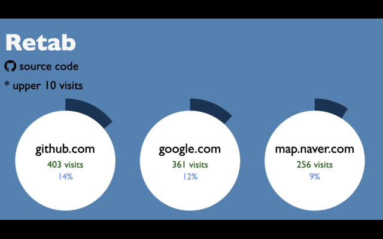

# Retab

_Rewind your tab history_

## Feature



Retab shows your browse history. It shows a graph, domain, number of visits, and percentage, starting with the most visited domains.

## Chrome API

Retab uses `chrome.history` [Chrome API](https://developer.chrome.com/docs/extensions/reference/api/history?authuser=1) for gathering user's browser history.

```js
chrome.history.search({ ...options }, (data) => {
  // your code
});
```
